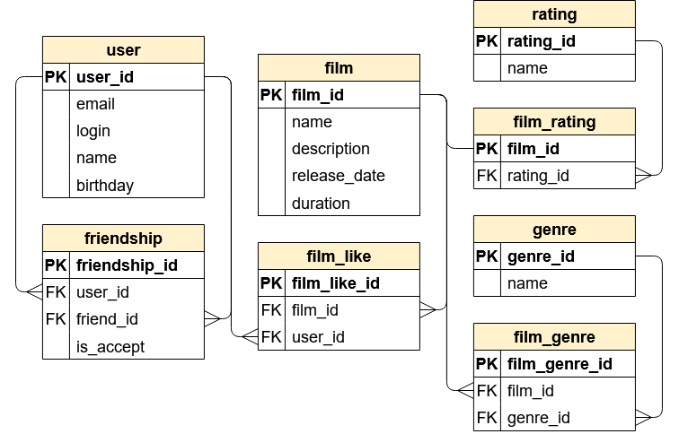

# java-filmorate
## ER-диаграмма
ER-диаграмма проектируемой базы данных для сервиса java-filmorate выглядит следующим образом:


## Текстовое описание схемы базы данных
### `user`
Содержит данные о пользователях.

Таблица включает следующие поля:
1. первичный ключ `user_id` - идентификатор пользователя;
2. `email` - электронную почту пользователя;
3. `login` - логин пользователя;
4. `name` - необязательное поле имени пользователя (если оно пустое, то подставится значение поля `login`);
5. `birthday` - дата рождения пользователя.
---
### `film`
Содержит данные о фильмах.

Таблица включает следующие поля:
1. первичный ключ `film_id` - идентификатор фильма;
2. `name` - название фильма;
3. `description` - описание фильма;
4. `release_date` - дата выхода фильма;
5. `duration` - продолжительность фильма в минутах.
---
### `friendship`
Содержит данные о заявках в друзья пользователей. 
Если заявка одобрена, то пользователи считаются друзьями друг для друга.

Таблица включает следующие поля:
1. первичный ключ `friendship_id` - идентификатор записи в данной таблице;
2. внешний ключ `user_id` (отсылает к таблице `user`) - идентификатор пользователя, отправившего заявку;
3. внешний ключ `friend_id` (отсылает к таблице `user`) - идентификатор пользователя, получившего заявку;
4. `is_accept` - статус заявки в друзья.
---
### `film_like`
Содержит данные о лайках пользователей каждого фильма.

Таблица включает следующие поля:
1. первичный ключ `film_like_id` - идентификатор записи в данной таблице;
2. внешний ключ `film_id` (отсылает к таблице `film`) - идентификатор фильма;
3. внешний ключ `user_id` (отсылает к таблице `user`) - идентификатор пользователя, поставившего лайк фильму.
---
### `rating`
Содержит данные о всех возможных рейтингах фильмов.

Таблица включает следующие поля:
1. первичный ключ `rating_id` - идентификатор записи в данной таблице;
2. `name` - название рейтинга;
---
### `film_rating`
Содержит данные о рейтинге для каждого фильма.

Таблица включает следующие поля:
1. первичный ключ `film_id` - идентификатор фильма;
2. внешний ключ `rating_id` (отсылает к таблице `rating`) - идентификатор рейтинга.
---
### `genre`
Содержит данные о всех возможных жанрах фильмов.

Таблица включает следующие поля:
1. первичный ключ `genre_id` - идентификатор записи в данной таблице;
2. `name` - название жанра;
---
### `film_genre`
Содержит данные о жанрах для каждого фильма.

Таблица включает следующие поля:
1. первичный ключ `film_genre_id` - идентификатор записи в данной таблице;
2. внешний ключ `film_id` (отсылает к таблице `film`) - идентификатор фильма;
3. внешний ключ `genre_id` (отсылает к таблице `genre`) - идентификатор жанра.
## Примеры запросов для основных операций приложения
Основные эндпоинты:
- `POST /users` — добавление пользователя. Пример тела запроса:
```
{
  "email": "gena123@yandex.ru",
  "login": "Gena_Baranov",
  "name": "Gennadiy",
  "birthday": "1990-01-01"
}
```
- `POST /films` — добавление фильма. Пример тела запроса:
```
{
  "name": "Film1",
  "description": "Test film1 description",
  "releaseDate": "1990-01-01",
  "duration": 210,
  "genres": [
      "COMEDY",
      "ACTION"
  ],
  "rating": "NC_17"
}
```
- `PUT /users` — обновление данных о пользователе. Пример тела запроса:
```
{
  "id": 1,
  "login": "Gena_Baranov",
  "name": "Gennadiy",
  "birthday": "1990-01-01"
}
```
- `PUT /films` — обновление данных о фильме. Пример тела запроса:
```
{
  "id": 1,
  "name": "Film1",
  "description": "Test film1 description",
  "releaseDate": "1990-01-01",
  "duration": 210
}
```
- `PUT /users/{id}/friends/{friendId}`  — добавление в друзья.
- `DELETE /users/{id}/friends/{friendId}` — удаление из друзей.
- `GET /users/{id}/friends` — список пользователей, являющихся друзьями пользователя с указаным id.
- `GET /users/{id}/friends/common/{otherId}` — список друзей, общих с другим пользователем.
- `PUT /films/{id}/like/{userId}`  — установка лайка пользователем фильму.
- `DELETE /films/{id}/like/{userId}`  — удаление лайка пользователем у фильма.
- `GET /films/popular?count={count}` — список из первых count фильмов по количеству лайков. 
Если значение параметра count не задано, вернутся первые 10.
- `PUT /users/{id}/friends/requests/{friendId}` — принятие заявки в друзья от пользователя с friendId пользователем с id.